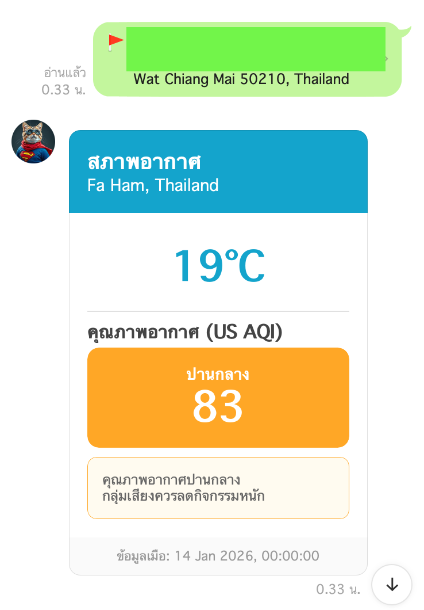
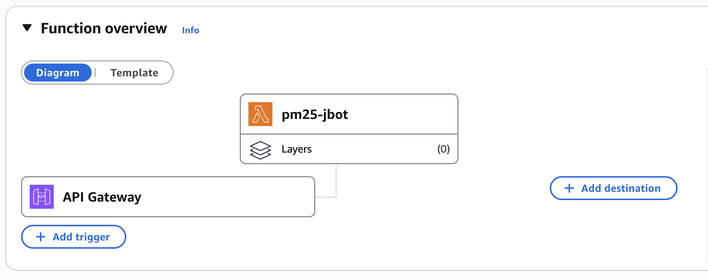

🌦️ **LINE Weather & PM2.5 Bot** (__Go + AWS Lambda__)
A high-performance, serverless LINE Bot built with Go that delivers real-time weather and air quality data from AirVisual API. It supports on-demand requests via text/location and automated daily reports via AWS EventBridge scheduling.

__**Features**__
- __On-Demand Weather:__ Text **"pm25"** or **"pm2.5"** triggers instant air quality data.

- __Location-Based Search:__ Send a location pin to get the nearest city's air quality information.

- __Automated Reports:__ Scheduled daily weather updates via AWS EventBridge (Cron) to specific LINE Group IDs.

- __Rich UI:__ Leverages LINE Flex Messages with dynamic color coding based on AQI and Temperature levels.

- __High Performance:__ Built with Go to significantly reduce AWS Lambda costs and execution time compared to JavaScript.

| Metric | JavaScript (Warm) | Go (Warm) | Advantage |
|--------|-------------------|-----------|-----------|
| **Execution Speed** | 611 ms | 250 ms | **2.4x faster** |
| **Billed Duration** | 612 ms | 250 ms | **60% cost savings** |
| **Max Memory** | 105 MB | 31 MB | **3x less memory** |

🛠️ **Tech Stack**
- __Language:__ **Go (Golang)**

- __Hosting:__ **AWS Lambda** (Amazon Linux 2023)

- __API:__ **AirVisual (IQAir)**

- __SDK:__ **LINE Messaging API SDK for Go v8**

__Deployment to AWS Lambda:__
1. Use **zipScript.sh** to build and compress the application
2. Upload the zip file to AWS Lambda
3. Set the Handler to **index.HandleRequest** in runtime settings

Thanks to Gemini for assistance with this documentation.